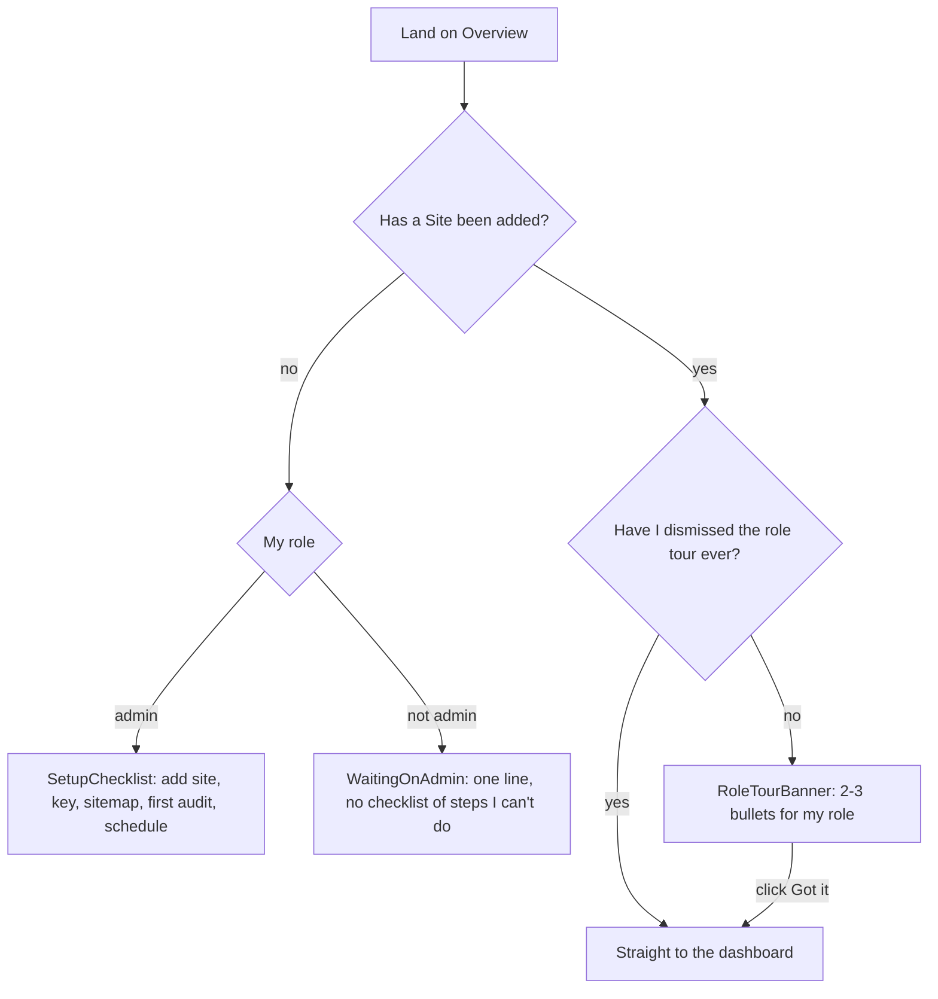
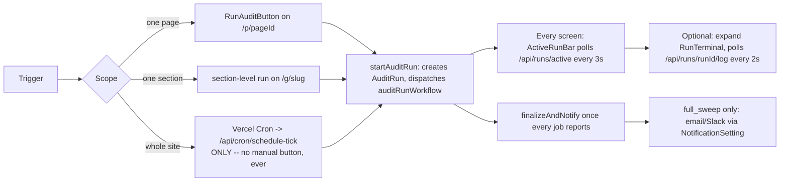
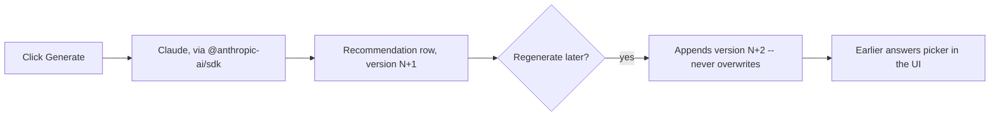

# App Flow — Internal PageSpeed Auditor

> Companion to `docs/PRD.md` (why) and `docs/UI_UX.md` (how it looks). This
> traces the actual navigable paths through the app as it runs today.
> Written 20 Aug 2026.

## 1. Getting in

```mermaid
flowchart TD
  A[/signup] -->|first person| B[Creates org, becomes admin]
  C[/invite?token=...] -->|teammate clicks email link| D[Sets a password, joins org at invited role]
  E[/login] --> F{Session cookie valid?}
  F -->|no| E
  F -->|yes| G[/ Overview]
  B --> G
  D --> G
```

- `/signup`: first user in a brand-new organisation is always `admin`.
- `/invite`: a teammate accepts at whatever role the admin picked
  (`Membership.role`), never self-elevated.
- `/forgot` → email link → `/reset`: standard password-reset flow, tokens
  hashed at rest, short-lived.
- `proxy.ts` is the UX layer that redirects an unauthenticated request to
  `/login`; `requireSession()` in every Server Action is the actual
  boundary (see `docs/TRD.md` §3, §7).

## 2. First run after login — role-aware onboarding

Added 20 Aug 2026, replacing a checklist that used to show every role the
same admin-only steps.



`RoleTourBanner` dismissal is per-**person**, not per-organisation
(`User.roleTourSeenAt`) — someone in two orgs sees it once, ever, not once
per site.

## 3. Running an audit

Three scopes, one underlying mechanism (`lib/workflows/auditRun.ts`):



A full sweep cannot be started by clicking anything, anywhere, by anyone —
see `docs/DECISIONS.md` §2.2. The MCP server's tool list has no
`run_full_sweep` for the same reason.

## 4. While a run is in flight

- **Hold** (`pause`) → nothing new starts; jobs already dispatched finish.
  Optimistic: the button flips to "Continue" the instant it's clicked
  (`useOptimistic`), reverting on its own if the server call fails.
- **Continue** (`resume`) → same optimistic flip, resumes at the next
  20-second poll inside `auditRunWorkflow`'s `sleep('20s')` loop.
- **Stop** (`cancelled`, not `failed`) → asks for confirmation first
  ("results already measured are kept; the rest is dropped, quota not
  refunded"), then the same optimistic flip hides the controls immediately.
- **Show live activity** (`RunTerminal`, collapsed by default) → per-page
  `start`/`ok`/`retry`/`error` lines, monospace, colour-coded, sourced from
  a small Postgres table (`RunLogEvent`, deleted once the run finalizes) —
  not a second copy of `AuditResult`.

## 5. Reading a report

```mermaid
flowchart TD
  A[/p/pageId?strategy=mobile|desktop] --> B[Scores: Performance/Accessibility/Best Practices/SEO]
  B --> C[Field data: Core Web Vitals Passed/Failed badge]
  C --> D[Lab metrics]
  D --> E[History: score trend, needs 2+ audits]
  E --> F["What to fix first" -- AI recommendation, on demand]
  F --> G[Opportunities / Diagnostics / Passed / Not applicable]
  G --> H[Run conditions -- environment, collapsible]
```

The Mobile/Desktop tabs are links (`StrategyTabs`), not client state — the
choice lives in the URL, survives a refresh, and renders server-side.
`SectionGrid`'s aggregate tiles need `key={strategy}` to remount on switch
(fixed 20 Aug 2026 — a real bug where they kept showing whichever strategy
was active on first load).

## 6. AI recommendations



Capped at `RECOMMENDATION_KEEP_VERSIONS` (10) per result. The prompt is
built from evidence tables (`AuditIssue`, up to 4 evidence rows each), never
from raw model guesswork about the stack.

## 7. Managing the site (admin only)

`/settings/site` → API key, sitemap re-ingest, storage stats
(`historyOverview`), and the delete-checks picker (`RunHistoryList` inside
Settings → Automation) — select specific historical checks, confirm, gone;
a run still in flight has no checkbox at all.

`/settings/automation` → schedule (frequency/day/time picker or a raw cron
expression), notifications (email/Slack), and the "Is it running?" panel
(scheduler heartbeat, recent checks). The schedule's enabled checkbox saves
itself instantly in the background; the rest of the schedule config still
needs the explicit "Save schedule" button — a deliberate split between a
low-stakes flip and deliberate configuration.

`/settings/team` → invite, remove, change a teammate's role.

## Related documents

`docs/PRD.md`, `docs/UI_UX.md`, `docs/TRD.md`, `docs/BACKEND_SCHEMA.md`,
`docs/IMPLEMENTATION_PLAN.md`.
