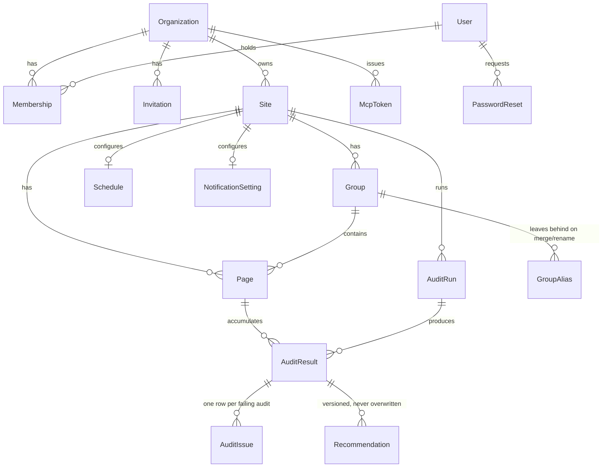

# Backend Schema — Internal PageSpeed Auditor

> `prisma/schema.prisma` is the source of truth; this document explains it.
> If the two disagree, the schema file is right and this needs updating.
> Written 20 Aug 2026, against the schema as of migration
> `20260820132653_rawjson_blob_key`.

## 1. Entity relationship overview

## 2. Identity and tenancy

- **`User`** — global identity. `roleTourSeenAt` (added 20 Aug 2026) gates
  the one-time role-tour banner; per-person, not per-organisation.
- **`Organization`** — the tenant. Everything else hangs off one.
- **`Membership`** — the join table that actually grants authority. Role
  is a plain string (`viewer`/`editor`/`developer`/`admin`), not a Postgres
  enum, specifically so adding a fifth role later is a code change, not a
  migration that locks the table.
- **`Invitation`** — token stored **hashed**, same reasoning as
  `PasswordReset`: a leaked database row must not be redeemable.
- **`McpToken`** — per-organisation, not one shared secret in an env var.
  A single shared token stops working the moment there's more than one
  tenant, since whoever holds it reaches whichever org happens to be
  queried.
- **`Organization.smtp*`** (added 20 Aug 2026) — an optional per-org SMTP
  override for invitation and sweep-notification emails, same nullable-
  presence-means-override shape as `Site.psiApiKey`; verified by a real
  connection check before saving. **Not** used for password resets: a reset
  is looked up by email address alone, before any organisation is known,
  and one `User` can hold `Membership` in more than one org, so there is
  no single tenant to pick a mailbox from. Resets always use the shared
  `SMTP_*` env vars. See `docs/DECISIONS.md`.

## 3. Site structure

- **`Site`** — one `psiApiKey` per site (nullable), never sent to the
  browser unmasked. Each tenant burns its own Google quota rather than
  sharing one and starving another.
- **`Group`** — a section (e.g. "Blog"). `isManual` marks a group whose
  identity is user-owned — never auto-renamed or auto-deleted by a
  re-ingest. `priority` (nullable) pulls a group forward in sweep order;
  null means "use sitemap position."
- **`GroupAlias`** — the record that survives a merge/rename. Without it,
  merging `/blog` and `/blogs` into "Blog" would lose the `blogs` slug, and
  the next ingest would recreate a group and pull pages back out of the
  merged one.
- **`Page`** — `isActive` (soft-delete: a URL dropped from the sitemap is
  deactivated, never deleted — the audit history is the product, not the
  URL list), `isManuallyGrouped` (pins this one page's group assignment
  against re-ingest), `latestResultMobileId`/`latestResultDesktopId`
  (denormalized pointers — turns "1,000 pages with current scores" from a
  correlated subquery per row into two plain joins).

## 4. The audit path

- **`AuditRun`** — one row per sweep/section-run/page-run. `status`
  includes `skipped` (the overlap guard refuses to start a sweep while
  another is running, rather than queueing behind it) and `cancelled`
  (a stopped run, distinct from `failed`). `completedJobs`/`totalJobs`
  drive every progress bar in the UI.
- **`AuditResult`** — one row per (run, page, strategy).
  - `status: "ok" | "error"` — **every aggregate query must filter
    `status: "ok"`**. An error row carries null scores so `completedJobs`
    can still reach `totalJobs` and the run can finalize; averaging it in
    unfiltered silently corrupts every trend.
  - Lab metrics (`lcp`/`cls`/`fcp`/`ttfb`/`tbt`/`speedIndex`) vs. field
    metrics (`fieldLcp`/`fieldInp`/`fieldCls`/`fieldFcp`/`fieldTtfb`) are
    separate column families on purpose — Lighthouse and CrUX measure
    different things and must never be conflated. **`inp` is field-only**;
    lab runs never produce it. **Never write `tbt` into `inp`** — it
    silently poisons every trend and regression comparison downstream.
  - `fieldCls` is **already divided by 100** — CrUX reports CLS × 100 raw.
  - `rawJson` (legacy inline) / `rawJsonBlobKey` (current, Vercel Blob) —
    exactly one of the two is ever set for a given row; see §5.
  - `@@unique([auditRunId, pageId, strategy])` is the durable idempotency
    guarantee — it's what survives a Redis-evicted, replayed Workflow step,
    the way a BullMQ jobId dedupe could not.
- **`AuditIssue`** — one row per failing audit per result, a deliberate
  denormalization out of `rawJson`. Grouping "top issues across the site"
  over JSON means detoasting the whole blob and running `jsonb_each` over
  ~180 audit objects per row on every dashboard load; this table turns
  that into one indexed `GROUP BY`, targeted at <50ms over 60k rows.
- **`Recommendation`** — `version` increments, never overwrites. The
  `@@unique([auditResultId, version])` pair is what makes a regeneration
  race-safe: two tabs both computing version N+1 race on the same insert,
  and Postgres lets exactly one win (`skipDuplicates`), no advisory lock
  needed.

## 5. Where the pruned Lighthouse JSON actually lives

Added 20 Aug 2026 (`docs/DECISIONS.md` §13). `AuditResult.rawJson` is now
**legacy-only** — every new row writes it `null` and stores a
`rawJsonBlobKey` pointing into Vercel Blob instead (`lib/blob.ts`), keyed
by `audit-raw-json/{runId}/{pageId}-{strategy}.json` — the same
`(auditRunId, pageId, strategy)` triple the unique constraint already
treats as unique, not the row's own id (which doesn't exist until the DB
assigns it on insert). No backfill ran; old rows keep their inline data
until the 10-per-page retention window ages them out naturally.
`pruneSiteHistory` and `deleteRuns` (the manual delete-checks picker) both
collect and clean up orphaned Blob objects — Postgres's cascading delete
can't reach a separate object store.

## 6. Retention

`retention.service.ts`, `DEFAULT_KEEP_RUNS = 10` (env-overridable via
`RESULT_RETAIN_RUNS`, floored at 2 — a value under that would leave
nothing to compare against). Runs after **every** `AuditRun` finalizes, not
just full sweeps. Deletes the whole row, not a hollowed-out one — a row
that still exists but has lost its evidence renders a report with no
tables, which is worse than saying the run aged out.

## 7. Scheduling and notifications

`Schedule` (one per site, `cronExpr` null = disabled, `timezone` is
team-local — "3am" should mean 3am where the people are) and
`NotificationSetting` (email/Slack, only sweeps notify — a channel that
pings on every on-demand page audit gets muted, which loses the alerts
that mattered).

## Related documents

`docs/TRD.md` (why the architecture is shaped this way),
`docs/DECISIONS.md` (numbered rationale for every non-obvious choice above,
especially §9 for ordering/run-control and §13 for the Blob move),
`docs/PRD.md`, `docs/APP_FLOW.md`, `docs/UI_UX.md`,
`docs/IMPLEMENTATION_PLAN.md`.
