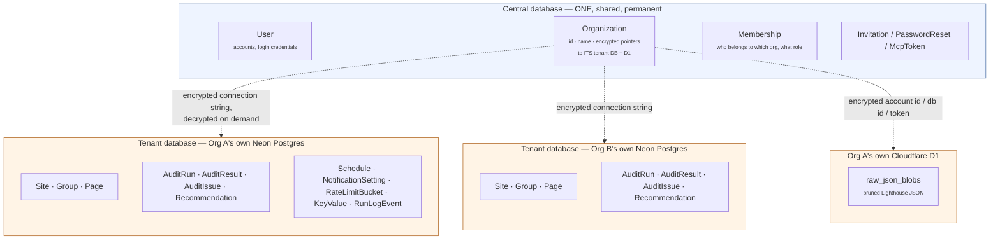

# Per-tenant architecture — how it actually works

> Companion to `docs/DECISIONS.md` §19 (the why) and `docs/PLAN.md`/`docs/BUILD_LOG.md`
> (the build history). This file is the *what*, explained plainly, for anyone
> picking up this work — including a future session that hasn't read the rest.

## The one-sentence version

There are **two kinds of database now**: one **central** database that never
changes (identity — who's a user, who's in which org), and one **tenant**
database **per organization**, created and owned by that organization, holding
all of its actual audit data. Cloudflare D1 follows the same split for raw
Lighthouse JSON.

Neither is a "parent" the other is copied from. They're two separate,
permanently distinct roles.

## The two roles, precisely

### Central database — permanent, always exists, tiny

Holds exactly five things, forever: `User`, `Membership`, `Organization`,
`Invitation`, `PasswordReset`/`McpToken`. This is the app's own identity
layer — you have to know *who* someone is and *which org* they belong to
before you can even figure out which tenant database to open.

`Organization` is the one row that bridges the two worlds: it carries the
org's name and id (central, identity-shaped data) **and** four encrypted
columns pointing at that org's own Neon connection string and D1 credentials
(`tenantDbUrlEnc`, `d1AccountIdEnc`, `d1DatabaseIdEnc`, `d1ApiTokenEnc`).
Nothing else in this database ever holds a `Site`, a `Page`, or an
`AuditResult` — that data has a different, permanent home.

**Today, this role is played by the one shared Neon database you already
have.** It doesn't get replaced or migrated away — it just narrows to only
this identity data once the cutover (Phase 5/6) finishes. You will always
own and pay for this one database, for every org combined — but it stays
small (accounts and org rows, not audit history), nothing like the volume
that made Vercel Blob a problem.

### Tenant database — one per organization, owned by that organization

Holds everything the app actually measures and reports: `Site`, `Group`,
`Page`, `AuditRun`, `AuditResult`, `AuditIssue`, `Recommendation`,
`Schedule`, `NotificationSetting`, plus the small operational tables
(`RateLimitBucket`, `KeyValue`, `RunLogEvent`).

Each one is created by the organization itself, pasting their own Neon
connection string into **Settings → Database**. It starts **completely
empty** — nothing is copied into it from anywhere. The app runs a fixed,
already-written set of `CREATE TABLE` statements (the compiled migration
in `lib/tenantDb/migrations.generated.ts`, built from
`prisma/tenant/schema.prisma`) against it once, and from then on that
org's every Site/Page/AuditRun lives there and nowhere else.

### Cloudflare D1 — same split, but with no permanent role at all

Right now there's one shared D1 database (the one we built together
earlier today) holding pruned Lighthouse JSON for the one organization
using this app. Once that org (and every future one) connects its own D1
via the same Settings → Database form, the shared one becomes **fully
unused** — not a fallback, not a parent, just retired. `lib/blob.ts`'s
fallback to the shared, env-configured D1 exists purely as a transition
bridge while the cutover is in progress; the end state (docs/DECISIONS.md
§19, decision 4) is every org brings its own, no shared tier, ever.

## So, to directly answer the question

> "the current setup... should be used as parent or source of truth here
> and when tenants accounts are created... we will run a migration and
> create the relevant tables in the users provided db and D1 right?"

- **The "run a migration to create tables in the user's own db" half is
  exactly right.** That's precisely what `provisionTenantAction` does.
- **"Parent or source of truth" is the part to correct.** The current
  Neon database becomes the *central* database — a permanent, different,
  smaller thing that only ever holds identity data, not a template tenant
  data descends from. The current D1 database isn't even permanent — it's
  a temporary stand-in that goes away once every org has its own.

## The provisioning flow, step by step

1. An admin opens **Settings → Database**, pastes their own Neon
   connection string and Cloudflare D1 credentials (account ID, database
   ID, API token).
2. The app validates both are real: a live `pg` connection to Neon, a
   live `SELECT 1` against D1's HTTP query API. Neon must also be
   genuinely empty (checked by looking for a pre-existing `Site` table —
   a heuristic, not exhaustive).
3. The app runs every tenant migration, in order, inside **one
   transaction** against the org's Neon database. A partial failure
   rolls back to nothing, so a retry starts clean.
4. The app encrypts all four credentials (AES-256-GCM,
   `lib/crypto/secretBox.ts`) and saves them on that org's `Organization`
   row in the central database. `provisionStatus` moves
   `unprovisioned → provisioning → ready` (or `failed`, with the real
   error kept for the admin to read).
5. From then on, any code that needs this org's data calls
   `getTenantPrisma(organizationId)` (`lib/db/tenant.ts`), which looks up
   the encrypted connection string in the central database, decrypts it,
   and returns a real client for that org's own database — cached per
   org so it isn't rebuilt on every request.

Rotating just the D1 token, or just the Neon URL, works independently —
saving the form again only re-validates and re-persists whichever fields
actually changed.

## What's built vs. what still routes through the old shared setup

As of this writing (Phase 4 complete), **the provisioning UI works, but
nothing else in the app uses it yet.** Every actual audit, every page
report, every Server Action still reads and writes the one original
shared database and the one shared D1 database, exactly as before this
work started. Connecting a database in Settings → Database right now
safely stores it — it just isn't *read* by anything yet.

That's Phase 5: rewiring the ~32 places that currently import one fixed,
shared database client so they resolve each org's own database instead.
The riskiest single piece of that is widening every Vercel Workflow step's
signature to carry `organizationId` — durable, in-flight audit runs need
to fully drain before that specific deploy, or a run already in progress
breaks on resume.

## A real gap, found while writing this doc — fixed

The Neon side of provisioning creates the org's tables. **The D1 side did
not** — validation only ran a `SELECT 1`, which succeeds even against a
genuinely empty, brand-new D1 database with no tables at all. Nothing
created that database's `raw_json_blobs` table the way the shared one
already had it.

**Fixed** (start of the Phase 5 session): `lib/tenantDb/provision.ts`
gained `ensureD1Schema(accountId, databaseId, apiToken)`, the same
`raw_json_blobs(pathname TEXT PRIMARY KEY, body TEXT, created_at INTEGER)`
`CREATE TABLE IF NOT EXISTS` the shared D1 database was set up with once,
by hand (§18). `app/actions/provisioning.ts` calls it right after
`validateD1Credentials` passes and before persisting the D1 fields, so a
saved org always has both a reachable D1 database *and* the table
`lib/blob.ts` actually reads and writes. `IF NOT EXISTS` makes re-running
this safe on a token rotation against an already-provisioned tenant.
Unit-tested in `test/provision.test.ts` against a fake D1 endpoint
(success, a Cloudflare-side rejection, and a network failure — the same
three cases `validateD1Credentials` already covered).

## Everything currently verified vs. not yet

| Piece | Status |
|---|---|
| Encryption utility (`lib/crypto/secretBox.ts`) | ✅ Built, unit-tested |
| Login org-picker | ✅ Built, verified against a real multi-membership account |
| Tenant schema + migration (`prisma/tenant/`) | ✅ Built, verified against real throwaway databases |
| Tenant-client resolver (`lib/db/tenant.ts`) | ✅ Built, and now called from everywhere — every page, Server Action, API route, MCP tool and workflow step that touches tenant data resolves its own org's client through it. Wired through as part of the Phase 5 cutover (see `docs/superpowers/plans/2026-08-21-per-tenant-phase5-cutover.md` and the Phase 5 entry in `docs/BUILD_LOG.md`) |
| Settings → Database UI + provisioning action | ✅ Built, validation logic verified against real throwaway databases |
| D1 table creation during provisioning | ✅ Fixed — see above |
| Every other page/action/workflow using the org's own database | ✅ Done — Phase 5 cutover. See `docs/superpowers/plans/2026-08-21-per-tenant-phase5-cutover.md` for the task-by-task plan and the Phase 5 entry in `docs/BUILD_LOG.md` for what shipped and what's still outstanding before it's fully done |
| Dropping the old shared tables from the central schema | ✅ Done, 22 Aug 2026 — `prisma/central/schema.prisma` now only declares `User`/`PasswordReset`/`Organization`/`McpToken`/`Membership`/`Invitation`/`RateLimitBucket`. Migration `20260822165559_central_narrow_to_identity_only` applied to **production only** — the old shared tables (with real historical audit data) still exist in local dev's central database. **Do not run `npm run build`/`npm run db:migrate`/anything invoking `prisma migrate deploy` against local until that data's fate is decided** — it would apply this same migration locally and drop it. `KeyValue` was also removed from the central schema (dead there since the scheduler heartbeat moved fully to per-tenant state); `RateLimitBucket` was kept, now serving a NEW purpose -- the shared-fallback PSI rate limiter (see `docs/DECISIONS.md` §19's "Fixed" note) |
| Removing the `CLOUDFLARE_*` env fallback | ❌ Not started — still load-bearing for any organisation without its own D1 |
| Migrating pre-cutover historical audit data into a real tenant database | ❌ Not done for either environment. Production's copy of this data was accidentally deleted (22 Aug 2026, outside of any of this session's actions) before a migration could be attempted — Neon point-in-time restore was offered and declined. Local dev's central database is now the only known surviving copy (747 pages, 1,522 results as of this writing) |
